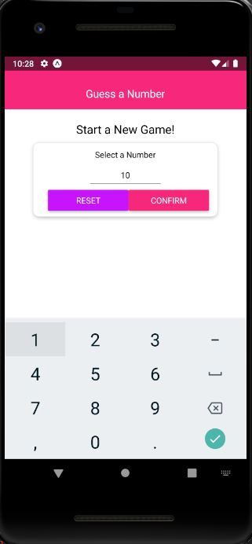
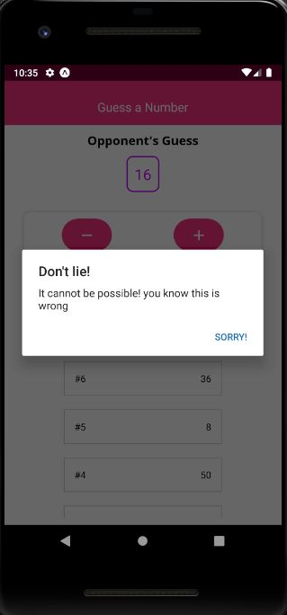

# GUESS NUMBER

My first react-native app, it use only components containing in differents folders following the react native folders structure

Start a New Game!.

Select a number and Start the Game.

Opponent's Guess.

Don't lie!!.

GAME OVER!!!.

